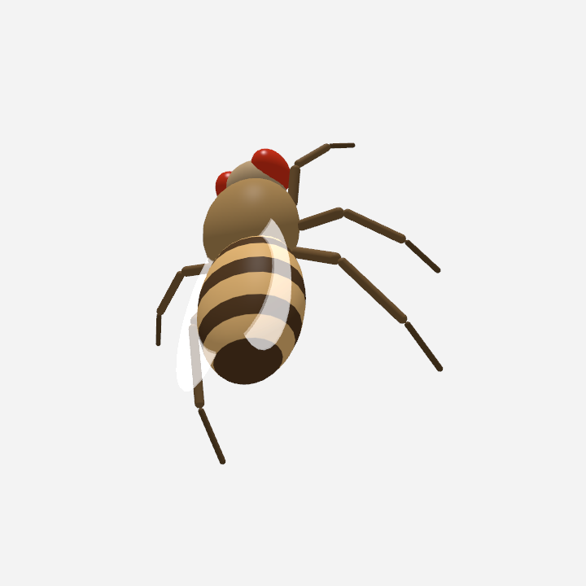

<p align="center">
  
</p>

<h1 align="center">DesktopFly for Linux 🪰</h1>

<p align="center">
A 3D fruit fly that lives on your Linux desktop — driven by a live spiking
simulation of the real <a href="https://codex.flywire.ai">FlyWire</a>
connectome. It walks across your windows, grooms, sleeps, and decides to flee
your cursor with the same neurons a real fly uses.
</p>

<p align="center">
  
</p>

<p align="center"><sub>
The fly's brain window: 23,210 real neuron soma positions from FlyWire v783,
with live spikes flashing at real neuron locations. The two glowing yellow
markers are the Giant Fibers — the escape command neurons. Click any region
to stimulate it.
</sub></p>

---

## This is a fork

The original is **[DesktopFly](https://github.com/DenisSergeevitch/desktop-fly)**
by **Denis Shiryaev**: his idea, his choice of which real neurons to simulate,
his simulation tuning, his behaviour model, his fly. The connectome itself is
not his and not this fork's — it is the FlyWire consortium's, and
[the section below](#where-the-neurons-come-from) traces where every number in
`data/` was actually measured. DesktopFly runs on macOS only, because every input and
output path in it is an Apple framework: SceneKit for the rendering,
`CGWindowListCopyWindowInfo` for the window terrain, `CGEventSource` for user
idleness, `ProcessInfo.thermalState` for the temperature, `NSStatusItem` for the
menu bar. None of those exist on Linux.

The science half does not care what operating system it is on. The
668-neuron leaky-integrate-and-fire network, the mapping from firing rates to
body commands and the behaviour state machine are arithmetic, and this fork
carries them over unchanged, constant for constant, along with both of
upstream's test suites. What is rebuilt is the half that touches the machine:
the overlay, the window sensing, the cursor, the temperature, the tray and the
renderer.

Two things shaped the rebuild:

- **It must not care about your window manager.** The fly lives on a
  `wlr-layer-shell` overlay surface with an empty input region. A layer surface
  is never placed in a tiling layout and never stacked below normal windows, so
  Hyprland, sway, river and a floating desktop all give the same result from the
  same code. On X11 the same idea is an override-redirect dock window with an
  empty input shape.
- **It must be portable outward.** Every operating-system touch point sits
  behind a small abstract class in `desktopfly/platform/`. A Windows port is one
  new module implementing six classes; nothing in the simulation, the behaviour
  or the renderer changes. [`DESIGN.md`](DESIGN.md) section 8 lists exactly what
  such a module has to provide.

Both ETL scripts and everything in `data/` are upstream's files, byte for byte,
so the fly here runs on exactly the same real neurons. See
[`third_party/UPSTREAM.md`](third_party/UPSTREAM.md).

## What's real

- **23,210 neuron soma positions** (of 139,255 in FlyWire v783) render the
  rotating brain window, coloured by super-class.
- **A 668-neuron circuit with 18,968 real synaptic connections** (synapse
  counts, signed by neurotransmitter prediction) runs as a 1 kHz
  leaky-integrate-and-fire simulation:
  - **LC4 (104) + LPLC2 (210)** looming-detector visual neurons
  - **DNp01 / Giant Fiber (2)** — the escape command neuron
  - **DNa01 + DNa02 (4)** steering · **DNp09 (2)** forward walking
  - **DNg11 (6)** grooming · **MDN (4)** backward walking ("moonwalker")
  - **DNp02/DNp04/DNp11 (6)** escape-manoeuvre (wing) neurons
  - their 330 strongest partners, including ascending (proprioceptive) and
    sensory (wind) neurons
- **A second connectome moves the legs.** A 1,045-neuron subgraph of the
  **MaleCNS v1.0** ventral nerve cord — 17,224 measured connections, 708,689
  contacts — runs alongside the brain at 1 kHz. Descending commands go in, six
  muscle channels per leg come out, and the joint angles and foot loads they
  produce go back in as proprioception. There are no gait oscillators: the
  walking has to fall out of the graph.
- **Escape is not scripted.** Your cursor's approach becomes looming input to
  the real LC4/LPLC2 cells; the fly takes off only when the Giant Fiber actually
  spikes through its real synapses — ~1,200 synapses of feedforward inhibition
  push back, which is why slow approaches are tolerated and fast lunges trigger
  escape in ~4 ms, just like the real animal. `--simtest` measures that latency
  on your machine and it comes out at 4 ms.

The body itself is procedural (neither connectome carries body geometry), with
articulated legs, a visible wing-beat, altitude-scaled flight, grooming and
sleep postures. A stag beetle is available as a second body; it is a different
set of shapes driven by exactly the same neurons.

**Where the measurement stops.** The MaleCNS graph measures contacts, not
effective physiological weights. Acetylcholine is assigned a positive sign,
GABA and glutamate negative ones; those are receptor-effect assumptions. The
annotation tables do not identify the modelled angle or velocity tuning, the
preferred direction or the particular joint any of the selected proprioceptors
senses, so every mapping of body angle, speed and load onto those cells is a
declared model assumption. A muscle label likewise supplies no force, no moment
arm and no activation kinetics. Many incoming connections are omitted — the
retained input coverage per motor channel is in `data/locomotor_report.json`.
A successful anatomical path check validates the extraction; it does not
validate biological motion.
[`data/LOCOMOTOR_PROVENANCE.md`](data/LOCOMOTOR_PROVENANCE.md) states the whole
boundary, and nothing here may claim more than that file does.

## Where the neurons come from

Neither this fork nor upstream digitised a single neuron. Everything in `data/`
is downstream of more than a decade of work by other people, and the chain is
worth stating in full:

1. **The brain was imaged.** *Zheng, Lauritzen, Perlman et al.* cut a
   seven-day-old adult female *Drosophila melanogaster* brain into ~7,000
   40 nm sections and imaged them by serial-section transmission electron
   microscopy at Janelia Research Campus, in Davi Bock's lab. That volume —
   about 21 million images — is **FAFB**, the Full Adult Fly Brain, and it is
   the physical measurement everything else rests on.
   *Cell* 174, 730–743 (2018).

2. **The neurons were segmented and proofread.** **FlyWire**, built by
   *Sebastian Seung's* and *Mala Murthy's* labs at Princeton, turned that image
   volume into individual reconstructed neurons: automated segmentation, then
   proofreading by hundreds of scientists and citizen scientists over years.
   *Dorkenwald et al., Nature Methods* 19, 119–128 (2022).

3. **The synapses were detected.** *Buhmann et al.* trained a network to find
   pre- and post-synaptic partners directly in the EM images, which is where the
   synapse counts on every edge in `data/circuit.json` come from.
   *Nature Methods* 18, 771–774 (2021).

4. **The neurotransmitters were predicted.** *Eckstein et al.* predicted the
   transmitter at each synapse from the electron micrographs. This is the
   `nt_type` field, and it is what makes every weight in this simulation
   **signed** — acetylcholine excitatory, GABA and glutamate inhibitory. Without
   it the escape circuit would have no inhibition to race, and the fly would
   flee everything.
   *Cell* 187, 2574–2594 (2024).

5. **The wiring diagram was released and annotated.** The FlyWire consortium
   published the finished connectome — 139,255 proofread neurons and tens of
   millions of synapses — together with the whole-brain cell-type annotations
   that let `etl.py` ask for "LC4" or "DNp01" by name.
   *Dorkenwald et al., Nature* 634, 124–138 (2024) and
   *Schlegel et al., Nature* 634, 139–152 (2024).

6. **It was made downloadable.** [FlyWire Codex](https://codex.flywire.ai)
   publishes the v783 release as the four CSV dumps `etl.py` reads.

What upstream added on top — and what this fork inherits — is the *selection*:
which 668 of those 139,255 neurons to simulate, and which cell type should drive
which behaviour. That mapping follows the published functional literature, for
example the giant fiber's looming-driven escape (*von Reyn et al.*, *Ache et
al.*), DNp09 initiating forward walking (*Bidaye et al., Neuron* 2020), MDN
driving backward walking (*Bidaye et al., Science* 2014), and DNa01/DNa02
steering (*Rayshubskiy et al.*). The LIF dynamics on top of that graph are a
model, not a measurement — see [What's modelled vs. measured](#whats-modelled-vs-measured).

### And where the nerve cord comes from

The legs are moved by a different animal. `data/locomotor_circuit.json` is a
bounded subgraph of the **MaleCNS v1.0** connectome — the male *Drosophila*
central nervous system, released by **FlyEM at HHMI Janelia** with the
**University of Cambridge**, the **MRC Laboratory of Molecular Biology** and
**Google Research**. It supplements the female FlyWire brain; it does not
replace that specimen and this is not a whole-CNS simulation.

Every retained edge is a published body-pair connection with at least five
contacts. Leg and side assignments come from explicit annotations — soma side,
subclass, entry nerve — never from graph position or body-ID parity. Motor
channels come from literal named muscle annotations, and anatomically unnamed
motor types get no guessed channel. The two specimens are joined by a modelled
population-rate interface, cell type for cell type: **there is no cross-specimen
synapse in either dataset**, and none is invented.

The MaleCNS files are **CC BY 4.0**, a different licence from the FlyWire files
beside them. `etl_malecns.py` rebuilds them from the public tables and embeds
every source URL, byte size and SHA-256 in the output.

## Installation

Requirements: Linux, Python 3.12+, a compositor with `wlr-layer-shell`
(Hyprland, sway, river, Wayfire, KDE) or any X11 window manager.

On Arch, build and install a real package — every dependency is in the official
repositories, no AUR:

```sh
git clone https://github.com/SilentAutomaton/desktop-fly-linux.git
cd desktop-fly-linux
makepkg -si
```

`makepkg` runs all three test suites as its check step, installs the connectome to
`/usr/share/desktop-fly/data`, and gives you `pacman -R desktop-fly` to undo it.
There is no `source=()` array, so it builds in the checkout itself and leaves
`dist/`, `build/`, `pkg/` and `src/` behind; `makepkg -sicC` clears them
afterwards.
The dependencies it pulls in are `python-numpy python-opengl python-gobject
gtk3 gtk-layer-shell`, plus the optional `libayatana-appindicator` (tray) and
`python-xlib` (X11 backend).

To run from a checkout instead, install those packages by hand and use
`python -m desktopfly`.

Debian/Ubuntu equivalents: `python3-numpy python3-opengl python3-gi
gir1.2-gtk-3.0 gir1.2-gtklayershell-0.1 gir1.2-ayatanaappindicator3-0.1
python3-xlib`.

Then:

```sh
desktop-fly
```

A 🪰 appears in your tray; quit from there, or with `desktop-fly ctl quit`. The
fly wanders your desktop on a transparent, click-through overlay — it never
intercepts your mouse or keyboard.

**Optional, for the tap and vibration senses**: reading `/dev/input` lets the fly
feel your clicks as substrate taps and your typing as vibration. It needs
membership of the `input` group (`sudo usermod -aG input $USER`, then log in
again). It is opt-in, it records only *that* a button or a key went down and
when — never which key — and everything works without it.

### Hyprland

The brain window is a normal window, so a tiling compositor will tile it. To
have it float:

```
windowrule = match:class ^(desktop-fly)$, float on
windowrule = match:class ^(desktop-fly)$, size 480 400
```

That is the rule syntax of Hyprland 0.53 and later. Before it, the same two
rules were written `windowrulev2 = float, class:^(desktop-fly-brain)$`. The
class is `desktop-fly` and not `desktop-fly-brain` because the fly's own
overlay is a layer surface with no class of its own, so the brain window is
the only toplevel this matches. On X11 the window also answers to
`desktop-fly-brain`.

Any menu item can be bound to a key, which is usually nicer than reaching for
the tray:

```
bind = SUPER SHIFT, F, exec, desktop-fly ctl scare
bind = SUPER SHIFT, B, exec, desktop-fly ctl brain
```

## Controls

The tray menu and `desktop-fly ctl` expose the same commands.

| tray item | `ctl` command | effect |
|---|---|---|
| Pause / Resume | `pause` · `resume` | freeze the world |
| Show / Hide Brain | `brain` | toggle the live brain window |
| Fullscreen Brain | `brain-fullscreen` | fill the screen with the brain |
| Hide Brain Hint | `brain-hint` | dismiss the controls hint in its corner |
| Escape Test (loom) | `escape` | inject a looming stimulus, watch the GF fire |
| Body: Stag Beetle | `body` | swap the body; the behaviour carries straight over |
| Move to Next Output | `next-output` | hop the fly across monitors |
| Add Fly · Remove Fly | `add-fly` · `remove-fly` | extra flies (only fly #1 carries the brain) |
| Scare Flies | `scare` | startle everyone |
| Quit | `quit` | |

**The brain window is explorable**: drag to orbit, scroll to zoom,
double-click for fullscreen, and hovering pauses the ambient rotation so a
region can be aimed at instead of chased. Clicking a region
"optogenetically" stimulates the ~60 nearest circuit neurons for 400 ms. The
fly's reaction is whatever the real network does downstream — click the Giant
Fiber and it escapes, click DNg11 and it grooms, click one side's DNa01/02 and
it turns. A short click stimulates and a long one orbits, so aiming and
spinning never fight each other.

## How real neurons drive the body

| body behaviour | driven by |
|---|---|
| escape takeoff | DNp01 giant fiber spike |
| walk vs. rest, walking speed | DNp09 rate |
| steering | DNa01+DNa02 left−right rate difference |
| grooming | DNg11 rate |
| backward scoot | MDN burst |
| nervous darting | LC4/LPLC2 population rate |
| wing-beat effort, threat wing-raise | DNp02/04/11 rate |
| spontaneous takeoff | whole-population arousal |
| every individual leg joint | MaleCNS motor neurons, per muscle channel |

Those descending rates are also what crosses into the nerve cord. Inside it,
premotor interneurons drive motor neurons named for the muscles they innervate
— tibia and trochanter flexors and extensors, coxal promotors, remotors and
rotators — and the six activations per leg become joint torques.

The loop closes body→brain twice over. Fast cursor motion stimulates the
circuit's sensory (wind) partners, and the legs report back: joint excursion and
speed to the chordotonal organs, hip angle to the hair plates, foot load to the
campaniform sensilla. Without the nerve cord the fly falls back to a scripted
tripod gait and a sinusoid into the ascending neurons, which is what it did
before v1.1.0.

## Desktop ecology

- **Window terrain**: window top edges are ledges — the fly lands on them,
  walks along them, rides a window you drag, and startles when one closes under
  its feet.
- **Window looms**: a window appearing near the fly feeds the looming pathway;
  the circuit decides whether to flee your dialogs. Drag a window out from under
  the fly and the ground goes with it, so it takes off.
- **Clicks are substrate taps**; clicking next to the fly startles it through
  the wind→GF pathway. **Typing is vibration** (when keys were pressed, never
  which).
- **Circadian rhythm**: dawn/dusk activity peaks, midday siesta, night
  quiescence. **Sleep**: idle at night → it sleeps, breathing slowly, with a
  raised arousal threshold; it grooms after waking.
- **Temperature**: flies are ectotherms — a hot laptop is a faster fly. The CPU
  temperature is read from `/sys/class/hwmon` and normalised against that
  chip's own critical threshold, so no machine needs tuning.

## Compatibility

Run `desktop-fly --probe` to see exactly what your session provides.

| session | overlay | window terrain | cursor looming | taps / typing |
|---|---|---|---|---|
| **Hyprland** | layer-shell | Hyprland IPC | yes | `/dev/input`, opt-in |
| **sway / i3-on-Wayland** | layer-shell | sway IPC | **no** — blind mode | `/dev/input`, opt-in |
| **river, Wayfire** | layer-shell | — | **no** — blind mode | `/dev/input`, opt-in |
| **KDE Plasma (Wayland)** | layer-shell | — | **no** — blind mode | `/dev/input`, opt-in |
| **any X11 WM** | dock window | `_NET_CLIENT_LIST` | yes | `/dev/input`, opt-in |
| **GNOME (Wayland)** | XWayland fallback | X clients only | yes | `/dev/input`, opt-in |

Two honest gaps, neither of which is worked around:

- **No Wayland protocol exposes the global cursor position**, and only Hyprland
  offers it over IPC. Elsewhere on Wayland the fly runs *blind*: window looms,
  taps, the circadian rhythm and the network's own noise still drive it, and it
  still walks, grooms, moonwalks, sleeps and takes off — it just cannot see your
  cursor coming.
- **GNOME's Mutter does not implement `wlr-layer-shell`** and has said it will
  not. The app falls back to X11 over XWayland there, which works but sits below
  native Wayland windows.

## Diagnostics

```sh
desktop-fly --probe            # which backends were chosen, and what each reads
desktop-fly --simtest          # circuit invariants: GF silent at rest, 4 ms loom latency, …
desktop-fly --behaviortest     # end-to-end checks: stimulate neurons -> body reacts
desktop-fly --locomotortest    # the nerve cord, the mechanics, and the loop between them
desktop-fly --brainshot b.png  # offscreen brain render
desktop-fly --snapshot f.png                     # three-quarter close-up of the body
desktop-fly --snapshot f.png --top               # the overlay's own view, the one you see
desktop-fly --snapshot f.png --top --walking     # a pose driven by live motor neurons
desktop-fly --snapshot f.png --top --beetle --flying
```

[`EVALUATION.md`](EVALUATION.md) records what those suites measure here beside
the numbers upstream published for the same runs.

All three suites are upstream's, ported number for number, and they are the
ground truth for any change to the simulation or the behaviour. They run
headless. `--locomotortest` is the one to run after touching anything shared by
the nerve cord and the body; several of its checks are lesions, because the
only way to show a movement travelled the path it claims to is to cut that path
and watch the movement stop.

## Configuration

Optional. Copy [`config.example.toml`](config.example.toml) to
`~/.config/desktop-fly/config.toml` and change what you want; the defaults
reproduce upstream behaviour exactly. Tuning constants for the network itself
are not settings — they live in `desktopfly/constants.py` with the reason each
one has its value.

## Regenerating the data

`data/` ships with compact derived files. To rebuild them from the raw FlyWire
Codex dumps (~60 MB download), using upstream's unmodified `etl.py`:

```sh
mkdir -p /tmp/flywire && cd /tmp/flywire
B=https://storage.googleapis.com/flywire-data/codex/data/fafb/783
curl -O "$B/classification.csv.gz" -O "$B/coordinates.csv.gz" \
     -O "$B/connections.csv.gz" -O "$B/consolidated_cell_types.csv.gz"
cd - && python3 etl.py /tmp/flywire
```

The nerve cord comes from a separate extraction, using upstream's unmodified
`etl_malecns.py`. It needs numpy, pandas and pyarrow, and streams ~1.11 GB of
public Feather tables:

```sh
python3 etl_malecns.py /tmp/fly-male-cns --download
```

It writes `data/locomotor_circuit.json` and `data/locomotor_report.json`, and
asserts real descending→motor paths to every leg's antagonist channels before
it will do so. The raw tables stay outside the repository. Both outputs should
come out byte-identical to the ones shipped here; their SHA-256 digests are in
[`third_party/UPSTREAM.md`](third_party/UPSTREAM.md).

## What's modelled vs. measured

Carried over from upstream, because it is still true here. The connectome gives
wiring, not physiology. The LIF dynamics, the neurotransmitter signs (ACh+,
GABA−, Glu−), the gap-junction boost on LC→GF and wind→GF (documented electrical
coupling), the synaptic delays and the sensory transduction (cursor → looming
value) are standard modelling choices layered on the real graph. Everything
downstream of the sensory neurons — who connects to whom, and how strongly — is
FlyWire data.

The same split holds for the nerve cord, and it is worth being blunter about
because a fly with moving legs invites more belief than it has earned. The
anatomy, the contact counts, the muscle names and the cell types are measured.
The neural dynamics, the sensory tuning, the muscle activation, the body
mechanics and the rate transfer between two different specimens are not. The
per-motor-channel input coverage of this extraction runs between 21% and 45%,
so the simulation is watching a fraction of what actually drives each muscle.
It walks; that is a property of this model, not a replay of the animal.

## Third-party code and licences

| what | where | licence |
|---|---|---|
| **DesktopFly** by Denis Shiryaev — the original project. `etl.py`, `etl_malecns.py` and `assets/` are vendored byte-identical; `Sim.swift`, `main.swift`, `FlyModel.swift`, `BeetleModel.swift`, `Locomotor.swift`, `LegDynamics.swift`, `LocomotorTests.swift`, `BrainView.swift` and `Environment.swift` are transliterated into `desktopfly/` with every constant unchanged | [DenisSergeevitch/desktop-fly](https://github.com/DenisSergeevitch/desktop-fly) | **MIT** — retained in [`LICENSE`](LICENSE) |
| **FlyWire FAFB v783 connectome** — the neuron reconstructions, synapse counts, neurotransmitter predictions, cell types and soma coordinates that `data/brain_points.json` and `data/circuit.json` are derived from. Not upstream's work and not this fork's; see [Where the neurons come from](#where-the-neurons-come-from) | [FlyWire Codex](https://codex.flywire.ai) | **CC BY-NC 4.0** — see [`data/DATA_LICENSE.md`](data/DATA_LICENSE.md) |
| **MaleCNS v1.0 connectome** — the male ventral-nerve-cord anatomy, contact counts, muscle and nerve annotations and transmitter predictions that `data/locomotor_circuit.json` is derived from. FlyEM at HHMI Janelia, the University of Cambridge, the MRC Laboratory of Molecular Biology and Google Research; see [And where the nerve cord comes from](#and-where-the-nerve-cord-comes-from) | [MaleCNS download](https://male-cns.janelia.org/download/) | **CC BY 4.0** — see [`data/LOCOMOTOR_PROVENANCE.md`](data/LOCOMOTOR_PROVENANCE.md) |
| **NumPy** — the 1 kHz network | runtime dependency | BSD-3-Clause |
| **PyOpenGL** — both renderers | runtime dependency | BSD-style (PyOpenGL licence) |
| **PyGObject** and **GTK 3** — windows, GL contexts, the main loop | runtime dependency | LGPL-2.1-or-later |
| **gtk-layer-shell** — the Wayland overlay surface | runtime dependency | MIT |
| **libayatana-appindicator** — the tray icon | optional runtime dependency | LGPL-2.1 / LGPL-3.0 |
| **python-xlib** — the X11 backend | optional runtime dependency | LGPL-2.1-or-later |

This fork's own code is MIT, under the same copyright notice as upstream's plus
its own. `data/` now holds two sources under two licences: **the FlyWire files
are CC BY-NC 4.0, so the bundle as distributed is non-commercial** even though
the code is not, and the MaleCNS files are CC BY 4.0. Keep the split intact.

## Changelog

### 0.2.1 — packaging and window identity

- **`makepkg` reaches `package()` again.** The build ran inside the checkout
  and never cleaned `dist/`, so a rebuild left two wheels there and the
  install step died on the duplicate files. It now cleans first and installs
  the wheel by name.
- **The brain window has a window class on Wayland.** It came up as
  `__main__.py`, which no window rule matched and which the compositor
  backends did not recognise as the fly's own surface — so the fly could land
  on and be startled by its own brain window.
- **The Hyprland rules in this README are the current syntax.**
- **`mypy --strict` runs again**, and is clean across the package. It had been
  pinned to a Python version numpy's own type stubs no longer parse at, so it
  aborted before checking anything. The floor is now Python 3.12.

### 0.2.0 — parity with upstream v1.1.0

- **MaleCNS locomotor circuit.** 1,045 real nerve-cord neurons drive the
  primary fly's articulated legs through joint and contact feedback, on one
  fixed 120 Hz clock shared by sensing, neurons, mechanics and the body.
- **A stag-beetle body**, swappable from the tray and from `ctl body`, with the
  behaviour layer untouched.
- **The brain window is explorable**: orbit, zoom, fullscreen, controls hint.
- **Frame-rate independence.** Fourteen filters and the cursor's own velocity
  measurement were tuned at 60 Hz and drifted everywhere else; the loom that
  reaches the giant fiber no longer depends on your refresh rate.
- **Measured walking kinematics**: turns are body saccades of 5–25° spent over
  ~90 ms, and swing duration is constant across speed instead of a fixed
  fraction of the step cycle.
- **Smooth transitions**: eased turns, blended leg poses, a damped landing
  flare and gated wing opening, plus a fix for the fly teleporting after a
  window it stood on was dragged sideways.
- New `--locomotortest` suite (18 checks); `--behaviortest` grows to 23.

## Citation

If you use this, cite the connectome. The two FlyWire terms require the first
two; the rest are the measurements the data actually rests on.

- Dorkenwald, S. et al. *Neuronal wiring diagram of an adult brain.* Nature 634, 124–138 (2024). https://doi.org/10.1038/s41586-024-07558-y
- Schlegel, P. et al. *Whole-brain annotation and multi-connectome cell typing of Drosophila.* Nature 634, 139–152 (2024). https://doi.org/10.1038/s41586-024-07686-5
- Zheng, Z. et al. *A complete electron microscopy volume of the brain of adult Drosophila melanogaster.* Cell 174, 730–743 (2018). https://doi.org/10.1016/j.cell.2018.06.019
- Dorkenwald, S. et al. *FlyWire: online community for whole-brain connectomics.* Nature Methods 19, 119–128 (2022). https://doi.org/10.1038/s41592-021-01330-0
- Buhmann, J. et al. *Automatic detection of synaptic partners in a whole-brain Drosophila electron microscopy data set.* Nature Methods 18, 771–774 (2021). https://doi.org/10.1038/s41592-021-01183-7
- Eckstein, N. et al. *Neurotransmitter classification from electron microscopy images at synaptic sites in Drosophila melanogaster.* Cell 187, 2574–2594 (2024). https://doi.org/10.1016/j.cell.2024.03.016

FlyWire is a project of Princeton University and collaborators. Please also
respect the FlyWire community guidelines and the CC BY-NC terms on the data.

Credit the original project this one is built on:
[DenisSergeevitch/desktop-fly](https://github.com/DenisSergeevitch/desktop-fly).
